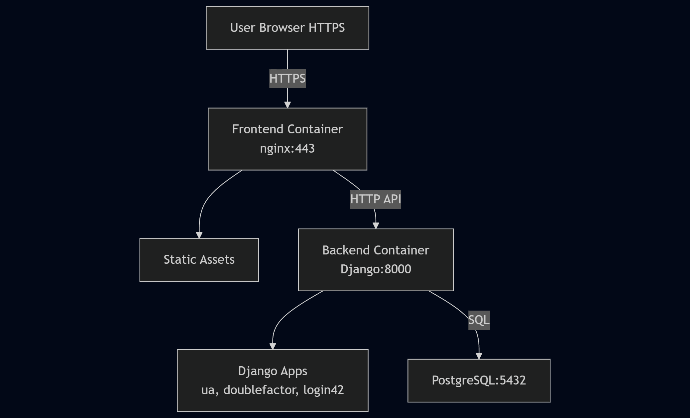
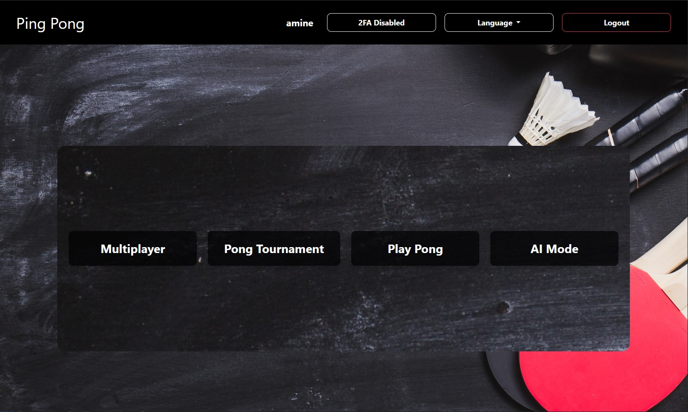
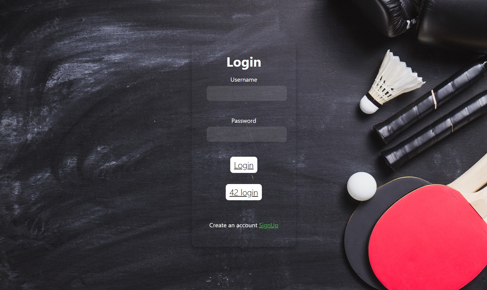
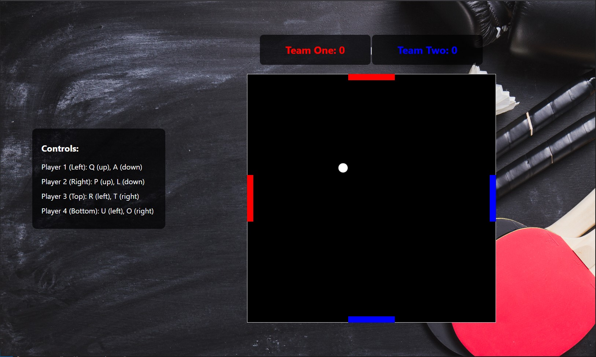
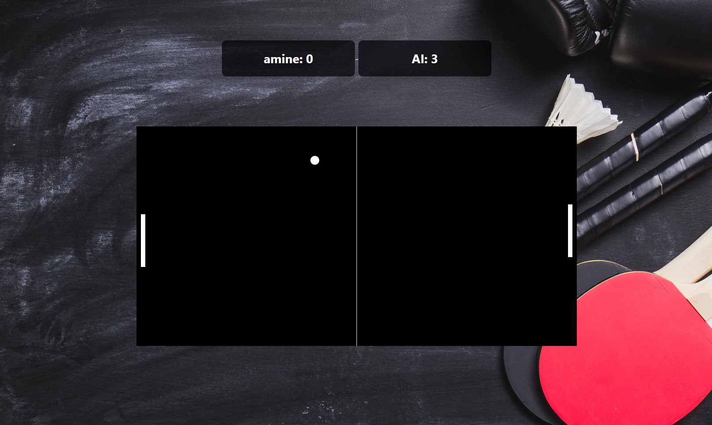
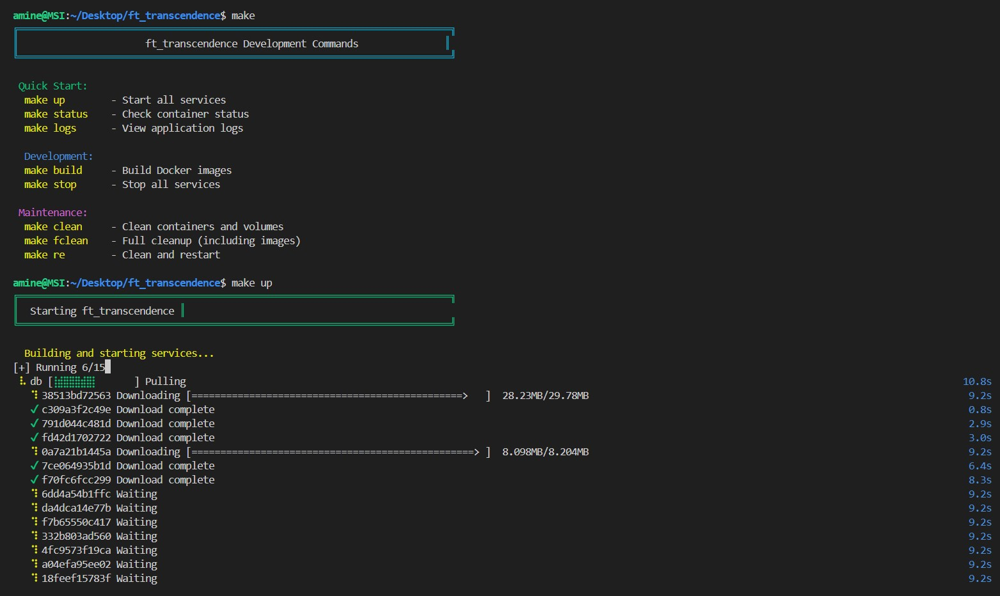

# ft_transcendence

A web-based multiplayer Pong game. Frontend uses HTML, CSS, and JavaScript. Backend uses Django REST API. The app runs in Docker containers with PostgreSQL database.

### Screenshots
<p align="center">
    
    
    
</p>
<p align="center">
    
    
    
</p>

## Features

- Real-time multiplayer Pong game
- Play against AI or other players
- Tournament system with automated matchmaking
- Single-page application with smooth navigation
- Two-Factor Authentication (2FA)
- JWT authentication
- Multi-language support
- PostgreSQL database
- Docker deployment
- Dockerized
- Runs with `docker-compose up --build` in rootless mode on Linux

---

## 🛠️ Chosen Modules

### 🧩 Major Modules

- **Framework Backend (Django)**: Scalable server-side solution.
- **Remote Authentication (OAuth 2.0 with 42)**: Secure login via 42’s OAuth 2.0.
- **Two-Factor Authentication (2FA) & JWT**: Enhanced security via 2FA (SMS/app/email) and JWT.
- **Multiple Players**: >2 players in a single game (e.g., 4-player squared board).
- **AI Opponent**: Simulates human play, uses power-ups (no A* algorithm).

### 🧱 Minor Modules

- **Database (PostgreSQL)**: Reliable data storage.
- **Front-End Framework (Bootstrap)**: Responsive UI.
- **Browser Compatibility**: Supports an additional browser.
- **Game Customization**: Power-ups, attacks, maps with user-friendly settings.
- **Multiple Language Support**: 3+ languages with a language switcher.

## Installation

### Requirements

- Docker
- Docker Compose
- Make (optional, for easier commands)

### Quick Start (Basic Mode)

This runs the app without email features. Good for testing.

1. Clone the repository:
```bash
git clone https://github.com/amine-za/ft_transcendence.git
cd ft_transcendence
```

2. Run with Make:
```bash
make up
```

Or without Make:
```bash
cp .env.example .env
docker-compose up --build
```

3. Open your browser and go to: https://localhost:443

Note: You will see a security warning because of the self-signed certificate. Click "Advanced" and "Proceed to localhost" to continue.

### Full Setup (With Email 2FA)

If you want Two-Factor Authentication via email to work:

1. After running `make up`, edit the `.env` file:
```bash
EMAIL_HOST_USER=your_gmail@gmail.com
EMAIL_HOST_PASSWORD=your_gmail_app_password
```

2. Get a Gmail App Password:
   - Go to your Google Account settings
   - Enable 2-Step Verification
   - Generate an App Password for "Mail"
   - Use that password in `.env`

3. Restart the containers:
```bash
make re
```

## Project Structure

```
ft_transcendence/
├── docker-compose.yml     # Docker setup
├── backend/               # Django API
├── frontend/              # HTML/CSS/JS files
└── images/                # Screenshots
```

## Technology Stack

- Frontend: HTML, CSS, JavaScript
- Backend: Django, Django REST Framework
- Database: PostgreSQL
- Deployment: Docker, Nginx
- Authentication: JWT, OAuth 2.0

## Security Features

- Password hashing
- Two-Factor Authentication
- JWT tokens
- Protection against SQL injection and XSS
- HTTPS support


Enjoy ft_transcendence! 🏓

